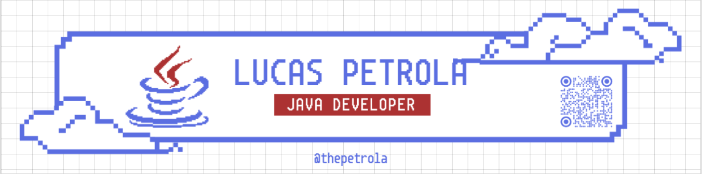

Desenvolvedor Backend Sênior, com mais de 10 anos de experiência com Java, Python, C e C++. **Em processo de migração de carreira para DevOps**. Já trabalhei como **Analista de redes e infraestrutura**, **Desenvolvedor Backend** e **Arquiteto de software**. Em projetos de desenvolvimento com realtime em empresas de **telecomunicações**,
em provas de conceito de **licitações para orgãos públicos**, bem como implatação e manutenção destes softwares dentro dos orgãos (Ganhamos todas as pocs 🤭),
em **grandes empresas privadas no ramo do comércio varejista**, e até como desenvolvedor em um **aplicativo adulto** 🤌.

  
<h3>📖 Sobre Mim</h3>

- 👀 **Desenvolvedor Backend Sênior** em processo de migração de carreira para **DevOps**.
- 👩‍💻 **Desenvolvedor Backend Java** na [Zello Tecnologia](https://www.zello.tec.br/).
- 📖 Voluntário na **Fábrica de Monstros** como **Mentor de Ciência de dados com Qlik** na [Zello Tecnologia](https://www.zello.tec.br/).
- 🫀 Apaixonado pelo meu trabalho e pela minha carreira!
- 🖨 Entusiasta em **impressões 3D**, **automação residencial** e **IoT**!
- 📘 Atualmente focado em projetos de **IoT**, **Agentes de IA** e **DevOps**
- 🐧 **Linux** Lover.

  
<h3>🛠️ Minhas ferramentas Favoritas</h3>

  
  #### 👨‍💻 Linguagens de programação e marcação
  
  
  
  
  
  
  
  

  #### 🧰 Frameworks and Libraries
  
  
  
  
  
  #### 🗄️ Databases e Hosting
  
  
  
  
  
  
  
  
  
  
  

  #### 💻 Editores e ferramentas
  
  
  
  
  
  
  

  #### 🐧 Sistemas Operacionais (Distros Linux pq eu sou pop)
  
  
  
  
  
  
  
  

  #### 👀🪛 Linguagens mais usadas
  

  
<h3>📊 Status e Atividades</h3>

  ### 💻 GitHub Profile Status
  

            
      
  

  
   
  
  <strong>Nota:</strong> As principais linguagens são apenas uma métrica das linguagens em que consiste meu código público e não reflete experiência ou nível de habilidade.

  
## Vocês podem me encontrar em:

